# Mathematics Malware Detected Tools

**重要**：由于缺少测试数据，部分结论可能不正确。更多更准确的结论，还需要进行大量实验。

## 概述
**mmdt(Mathematics Malware Detected Tools)**是一款基于数学方法的最简单的类“机器学习”工具。该工具通过数学方法对目标对象进行处理，生成相应的标准“指纹”，通过对指纹的处理，实现“机器学习”中的“分类”、“聚类”方法。
并在此基础上，从“分类”衍生出恶意代码检测功能，从“聚类”衍生出恶意代码同源样本挖掘功能。

备注：

1. 对该工具而言，分类、聚类之间**唯一的区别**是有无已知标签，除此之外完全一样。
2. 这里“分聚类”的意思已经几乎等价于机器学习中的分聚类，类似的，分类需要有已知的训练集，聚类则不需要。

### 工具特点
工具特点如下：

1. 还原最古老、原始、简单的机器学习过程，
2. 实现从数据到信息的转换，适用于最真实的大数据场景
3. 检测过程高效、快捷，支持多级索引，实现毫秒级处理
4. 单机模式对百万级数量的特征实现毫秒级的检索、匹配
5. 实现100%“见过即可查”，将检出问题简单转化为数据问题，数据越多，检出越多
6. 不用担心数据灾难，维度灾难等问题。
7. 支持几乎所有文件格式

### 工具目的
可参考著名工具[ssdeep](https://github.com/ssdeep-project/ssdeep)的目的及意义。

该工具相对于ssdeep的优势：

1. 处理结果的记忆属性：提供处理结果存储功能，实现对历史数据的回溯。
2. 对大数据的支持：单机版支持百万级别的特征数量，100万条特征所占磁盘空间不足100M。
3. 快速高效的匹配：增加多级索引模式，支持更高效快速的检索、匹配。
4. 完整的使用流程：傻瓜式的适用方式，类似于常规机器学习过程，设置标签，配置参数，提供训练集，即可以自动化的生成最小规则库（机器学习中的最小模型）
5. 智能的学习过程：学习结果实时反馈，避免重复学习。

### 原理概要
通过压缩算法对文件进行缩放，生成标准文件、使用哈希函数对标准文件进行处理，得到“分片”哈希（指纹）。详细内容参见后续论文（撰写论文中）。

（**原理不够，表情包凑。**

在**完全一样**的约束条件下，能推论出一个**特解**。我的状态：


弱化(减少)约束条件之后，面对新的数学问题时，我的状态：


在群里请教大佬数学问题时，我的状态：


## 配置参数说明

### <a name="main_ini"></a>main.ini
主配置文件，用于配置执行相关功能时的参数选项。

```
[version]
auto-add=0                     // function-type=3时生效，用于分类“训练模型”时（是否自动更新模型）0：不更新，非0：更新
auto-move=0                    // 用于聚类时是否移动文件，0：不移动，非0：移动
function-type=3                // 选择功能，2:相似度计算比较，3:分类训练/扫描，4:聚类
normalization-standar=100      // 归一化标准，默认100
scan-level=10                  // 扫描覆盖率，取值在[0, 5]之间时越大覆盖率越高，准确性越低，其他值为默认扫描，覆盖率最低，准确性最高
first-level=60                 // 方式1的准确度，取值在[0, 100]之间，越低越准确，覆盖率越低
second-level=50                // 方式2的准确度，取值在[0, 100]之间，越低越准确，覆盖率越低
accury-level=3                 // 计算相似度方式，取值为1、3，取值为1时使用低精度方式，取值为3时使用高精度方式
thresold=0.5                   // 判定阈值
classify-id=-1                 // 分类“训练模型”是生效，需要给定当前这批文件的标签
max-cluster-number=1000        //支持最大聚类数量
max-file-size=20971520         //支持最大处理文件大小20M，超过的截断处理
rule-file=rule.db              // 规则库（模型存储）
label-file=classify-label.ini  // 标签配置文件
```

### classify-label.ini
标签配置文件，用于分类（扫描）时，将id转成对应的字符串，节约存储空间。详细使用参考[使用场景](#USE_PAN)

```
[version]
version=1.0.0

[owner]
name=mmdt

[label_name]
-1=Unknown              // id: -1 保留值，映射为 Unknown
0=Clean                 // id: 0 保留值，映射为 Clean
1=Sality                // id: 1 自增，映射为 Sality（病毒名）
...                     // 后续依次自增
```

### cmd参数
参数意义见[main.ini](#main_ini)

```
Version: 1.0.0
Options:
    --help,                   -h,show help info.
    --auto-add,               -a,auto add rule.
    --auto-move,              -b,auto move cluster.
    --function-type,          -f,function type.
    --normalization-standard, -n,normalization standard.
    --scan-level,             -l,scan level.
    --first-level,            -d,first level.
    --second-level,           -e,second level.
    --classify-id,            -j,classify id.
    --thresold,               -p,thresold value.
    --compare-file,           -c,comare file.
    --max-cluster-number,     -m,max cluster number.
    --ini-file,               -i,ini file
    --label-file,             -o,label file
    --rule-file,              -r,rule file
    --target,                 -t,target
```

## <a name="USE_PAN"></a>使用场景
本段落主要说明工具的用法以及怎么用。不同的使用场景需要配置不同的参数。

目前考虑到使用场景具体包括：

1. 分类场景，恶意代码检测
2. 聚类场景，自动同源性的化恶意代码挖掘
3. 相似度计算场景，如计算可执行文件相似度、计算源代码相似度、计算webshell相似度、计算宏代码相似度、计算图片相似度

### 分类场景
#### 生成特征库(模型“训练”)
对有标签样本提取特征，生成指纹，融入特征库。

执行命令如下：

1. `./mmdt -f 3 -a 1 -j 1 -r rule.db -o classify-label.ini -t /Users/ddvv/gitcode/mmdt/tmp/test/Sality/`
2. `./mmdt -f 3 -a 1 -j 2 -r rule.db -o classify-label.ini -t /Users/ddvv/gitcode/mmdt/tmp/test/Berbew/`
3. `./mmdt -f 3 -a 1 -j 3 -r rule.db -o classify-label.ini -t /Users/ddvv/gitcode/mmdt/tmp/test/Gandcrab/`
4. ...（依次对其他文件夹进行处理，生成库文件[“模型”]）

```
-f: 3表示采用扫描/训练模式
-a: 1表示自动存储满足条件的指纹
-j: 1表示标签id
-r: 特征库文名称
-o: 标签文件
-t: 目标对象，可以是单个文件，也可以是目录（目录必须带上最后的斜杆）
```

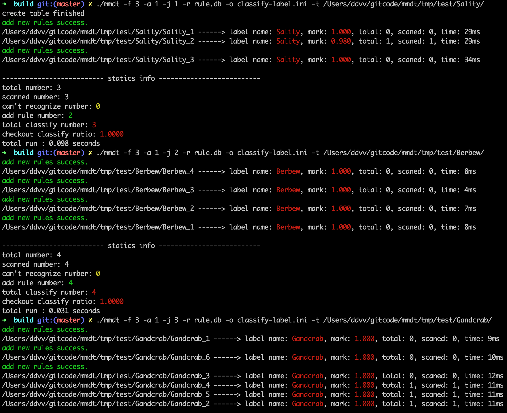

#### 可执行文件检测
执行命令：

1. `./mmdt -f 3 -r rule.db -o classify-label.ini -t /Users/ddvv/gitcode/mmdt/tmp/test/Wabot/`
2. `./mmdt -f 3 -r rule.db -o classify-label.ini -t /Users/ddvv/gitcode/mmdt/tmp/test/Gandcrab/`

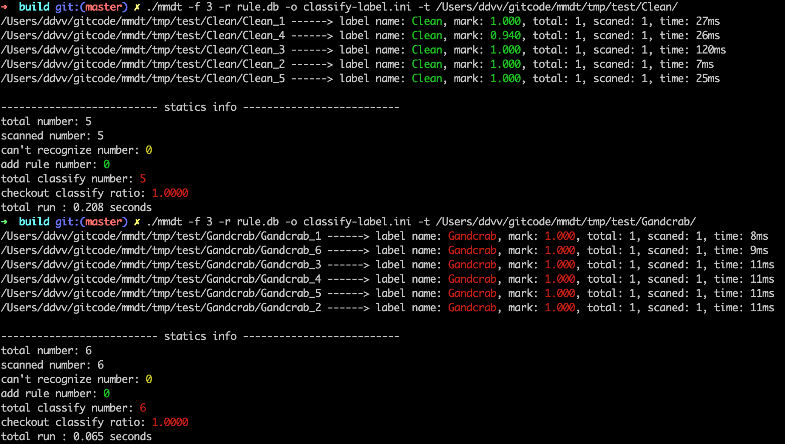

输出检出情况。

```
total number: 表示一共扫描的文件个数
scanned number: 表示本工具能处理的文件个数
can't recognize number: 表示本公举不能处理的文件个数
add rule number: 表示添加的规则数
total classify number: 表示能识别的文件总数
checkout classify ratio: 表示识别率
total run : 表示本次程序执行时间
```

#### 非可执行文件检测(与PE文件检测完全一致)
执行命令：

1. 扫描宏：`./mmdt -f 3 -r rule.db -o classify-label.ini -t /Users/ddvv/gitcode/mmdt/tmp/test/Macros/`
2. 扫描11882漏洞利用：`./mmdt -f 3 -r rule.db -o classify-label.ini -t /Users/ddvv/gitcode/mmdt/tmp/test/CVE-2017-11882/`

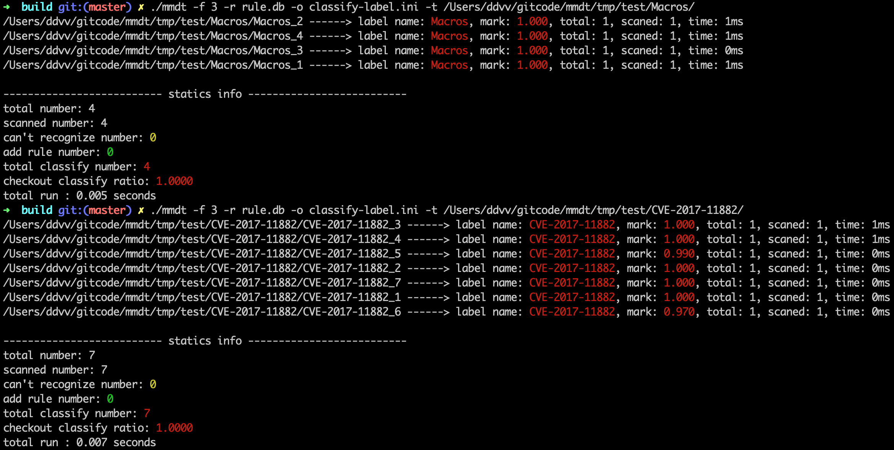


### 聚类场景

#### 恶意代码聚类
对51个文件，共计9个大类进行聚类，执行命令：

1. 聚类，并将同类移动到同一个文件夹下：`./mmdt -f 4 -b 1 -m 1000 -t /Users/ddvv/gitcode/mmdt/tmp/test/All/`

```
-f: 4表示采用聚类模式
-b: 1表示自动移动同源文件到相同目录
-m: 表示本次聚类支持的最大类别数量
-t: 目标对象，可以是单个文件，也可以是目录（目录必须带上最后的斜杆）
```

结果如下：

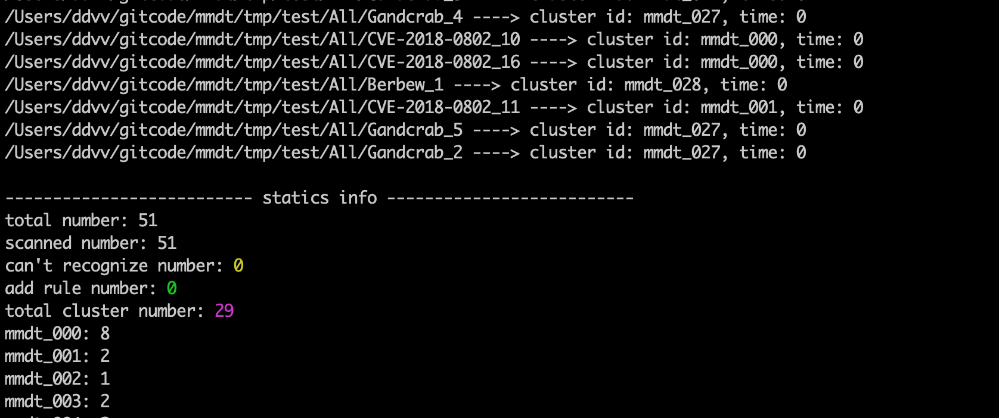

51个样本聚类数量29类。从截图信息可以看出，mmdt_000是CVE-2018-0802类型，共计8个样本

### 相似度计算场景
用于计算文件间的相似度。

#### 恶意文件相似度计算
##### 计算Gandcrab_2和其他文件之间的相似度，执行命令：

`./mmdt -f 2 -c /Users/ddvv/gitcode/mmdt/tmp/test/Gandcrab/Gandcrab_2 -t /Users/ddvv/gitcode/mmdt/tmp/test/All/`

```
-f: 2表示采用计算相似度模式
-c: 表示比较的目标对象(只能是文件，不能是文件夹)
-t: 表示目标对象，可以是单个文件，也可以是目录（目录必须带上最后的斜杆）
```

结果如下：

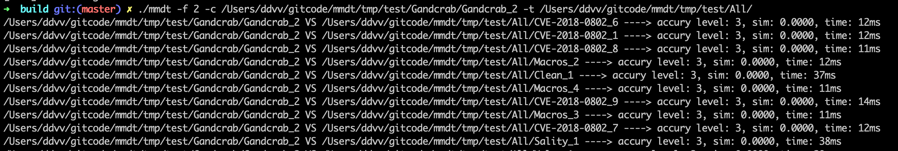
...
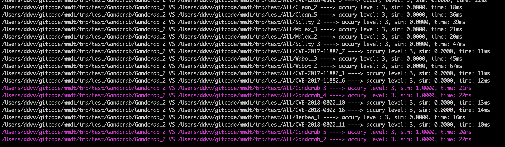

##### 计算CVE-2018-0802_1和其他文件之间的相似度：执行命令：

`./mmdt -f 2 -c /Users/ddvv/gitcode/mmdt/tmp/test/CVE-2018-0802/CVE-2018-0802_1 -t /Users/ddvv/gitcode/mmdt/tmp/test/All/`

结果如下：

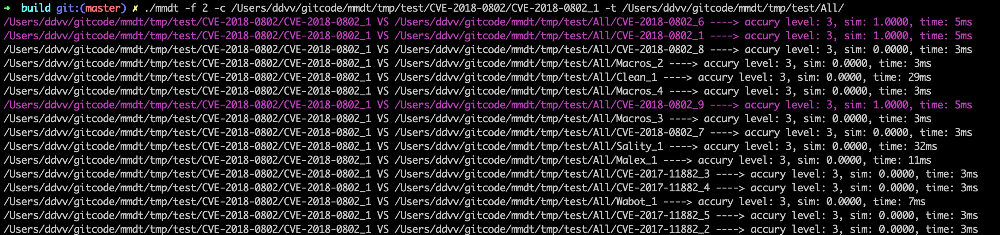

#### 源代码相似度计算
对ssdeep中不同commit间的engine.cpp源码进行相似度计算，原始差异如下图：

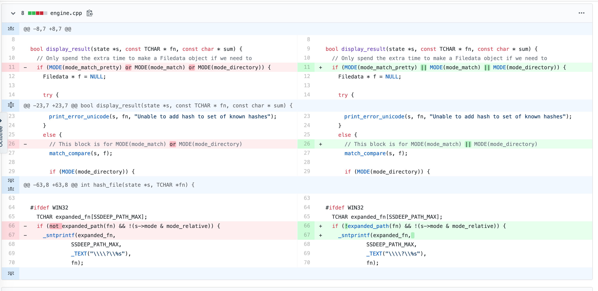

执行命令(归一化标准设置为500)，

`./mmdt -f 2 -n 500 -c /Users/ddvv/gitcode/mmdt/tmp/test/source/engine_new.cpp -t /Users/ddvv/gitcode/mmdt/tmp/test/source/engine_old.cpp`

相似度计算结果如下：

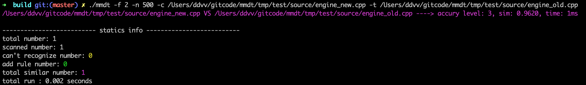

#### webshell相似度计算

对webshell进行相似度计算，原始差异如下图：

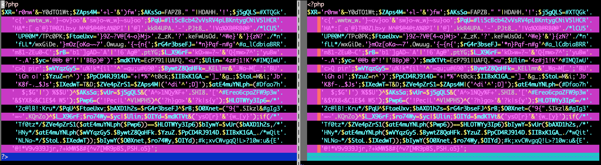

执行命令(归一化标准设置为默认100)，

`./mmdt -f 2 -c /Users/ddvv/gitcode/mmdt/tmp/test/webshell/php1 -t /Users/ddvv/gitcode/mmdt/tmp/test/webshell/`

相似度计算结果如下：

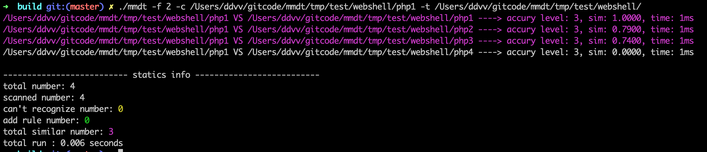

#### 宏代码相似度计算
对宏代码进行相似度计算，原始差异如下图：

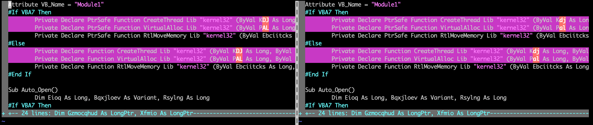

执行命令(归一化标准设置为默认100)，

`./mmdt -f 2 -c /Users/ddvv/gitcode/mmdt/tmp/test/Macros/Macros_3 -t /Users/ddvv/gitcode/mmdt/tmp/test/Macros/`

相似度计算结果如下：

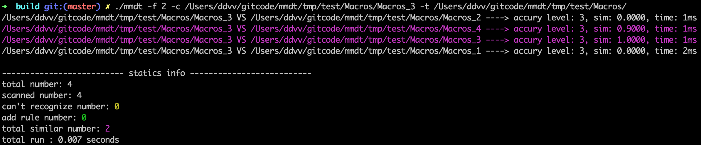

#### 其他使用场景
通过一些参数优化等方式，**有可能**也能利用在相似图像查找上面。

原图如下：

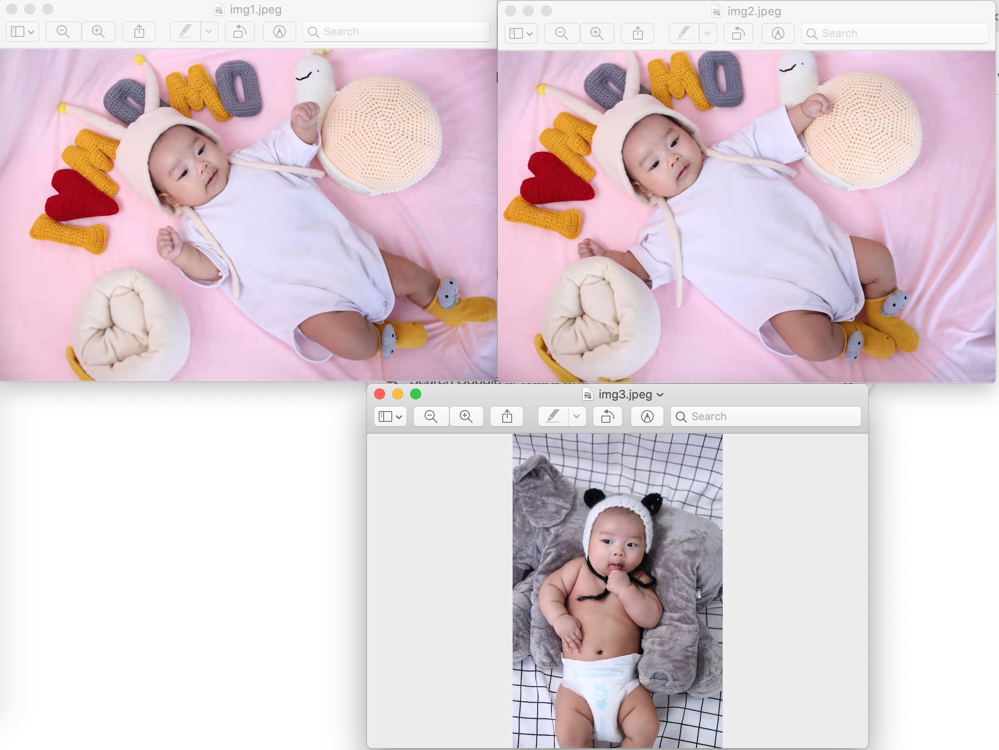

执行命令(归一化标准设置为210)，

`./mmdt -f 2 -k 3 -n 210 -c /Users/ddvv/gitcode/mmdt/tmp/test/Img/img1.jpeg -t /Users/ddvv/gitcode/mmdt/tmp/test/Img/`

相似度计算结果如下：

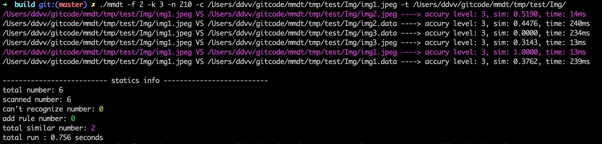


## 恶意代码检测

对314个恶意样本使用同一参数（见[main.ini](#main_ini)文件），进行测试统计（样本来源参考[malware-samples](https://github.com/fabrimagic72/malware-samples)和[APT-Sample](https://github.com/Cherishao/APT-Sample)）。

|标签名|样本数量|规则数量|规则/样本数量比率|
|----|-----|-----|-----|
|Clean|5|4|0.800|
|Sality|3|2|0.667|
|Berbew|4|4|1.000|
|Gandcrab|6|3|0.500|
|Malex|3|1|0.333|
|Wabot|3|3|1.000|
|CVE-2017-11882|7|5|0.714|
|CVE-2018-0802|16|4|0.250|
|Macros|4|3|0.750|
|Malware|78|71|0.910|
|APT|185|171|0.924|
|总计|314|271|0.863|

RS比率=规则/样本数量比率

可推导出的结论包括：

1. RS比率越低表示识别效果越好
2. RS比率与恶意样本类型相关
3. RS比率高低与配置参数相关
4. 放大数据集，RS比率会降低

## 其他

### 为什么不开源代码？

主要还是如下两个原因：

1. code水平很差，代码太丑，暂时不好意思开源
2. 这个工具是论文的验证demo，需要完成论文后，才方便开源

### 为什么提供该工具？
出于两方面的原因考虑：

1. 主要希望能换取更多的合法数据（样本），进行测试
2. 次之希望有大佬能提供测试结果，能引用到论文中。

### 未来是否对这个工具的改进？

会。比如考虑支持以下一些场景和功能：

1. 结合动态技术，对内存做运算，生成指纹，进行匹配
2. 增加C/S，B/S模式，增加缓存机制，以支持更大数据集提供更好的特征子集
3. 智能配置文档生成，更优支持更多的文件类型

### Github地址
Github -- [ddvv](https://github.com/a232319779/mmdt)

### 压缩包解压码

解压码：**mmdt**